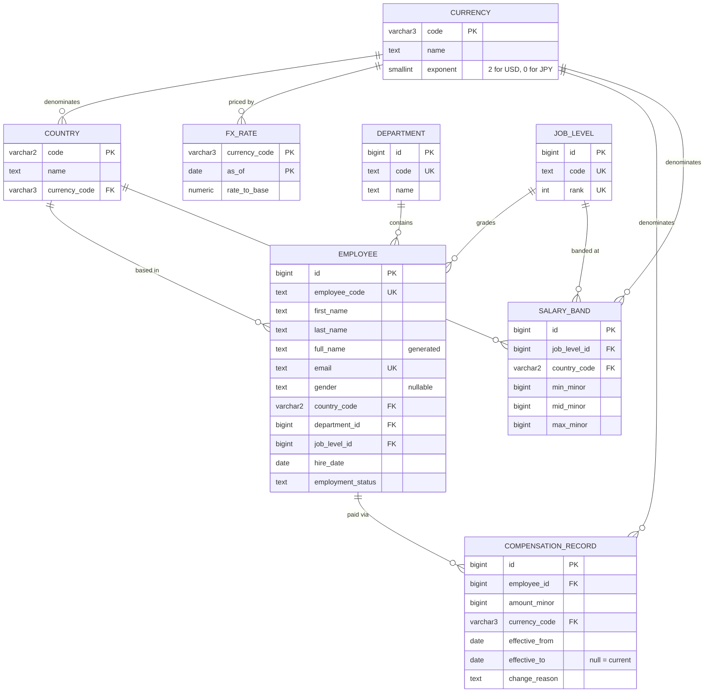

# Architecture

Scope and the reasoning behind it live in [requirements.md](requirements.md).
This document covers **how** it is built.

## Shape

```
Next.js (web)  ──HTTP/JSON──►  Spring Boot (api)  ──JDBC──►  PostgreSQL
```

Two deployable units, not one. A Next.js app with route handlers would have been
fewer moving parts, but the brief asks for a backend and a UI, and a separate API
keeps the compensation rules in one testable place instead of spreading them
across server components.

## Data model



`FX_RATE` has no foreign key to `COUNTRY` on purpose — rates are keyed by
currency, and several countries can share one (Germany and Spain both use EUR).

`CURRENCY` exists as a table rather than a bare code because of `exponent`. It is
what makes the difference between ¥7,835,821 and ¥783,582,100 — see below.

## The five decisions that matter

### 1. Money is an integer count of minor units

`amount_minor BIGINT` plus an ISO-4217 `currency_code`. Never `double`, and not
`NUMERIC` either.

Floating point is disqualified outright — `0.1 + 0.2` is the canonical reason.
`NUMERIC` would be correct, but an integer count of the smallest currency unit
makes it structurally impossible to end up with a fraction of a cent, and it maps
to `long` in Java with no precision questions at the boundary. The cost is that
every read and write must scale by the currency's exponent; that lives in one
place and is unit-tested.

`BIGINT` because a JPY salary in minor units comfortably exceeds `INT` range.

**How many minor units make a major unit is a property of the currency**, not a
constant. USD has two decimal places; JPY has none. `currency.exponent` records it,
and every conversion goes through it. Hard-coding 100 would have made every yen
figure a hundred times too large — the derived salary bands surfaced exactly that
bug during Phase 2, which is why the `currency` table exists at all.

Identifiers come from **sequences with `INCREMENT BY 50`**, matching Hibernate's
pooled allocation, rather than `IDENTITY` columns. `IDENTITY` forces Hibernate to
read a generated key back for every row, which silently disables JDBC batching —
and Phase 3 inserts 10,000 employees.

Fixed-width codes are `VARCHAR`, not `CHAR`. Postgres documents no performance
advantage for `CHAR`, and its blank padding turns `'USD'` into `'USD '` on the way
back into Java.

### 2. Compensation is effective-dated, never updated

A raise **inserts** a row and closes the previous one by setting its
`effective_to`. `effective_to IS NULL` means "current". Nothing is ever
overwritten.

This gives salary history, auditability, and "what were we paying in March?" for
free, from the same table that answers "what do we pay now?". The alternative —
a `salary` column on `employee` plus a separate audit log — makes the history a
side effect that can drift from the truth.

Two invariants are enforced **by the database**, not by application code:

```sql
EXCLUDE USING gist (
  employee_id WITH =,
  daterange(effective_from, effective_to) WITH &&
)
```

means overlapping pay periods for one employee are impossible, and a partial
unique index on `(employee_id) WHERE effective_to IS NULL` means an employee can
have at most one open record. Service-layer checks would be racy; these are not.

### 3. Salary bands per level and country

A band (`min`/`mid`/`max`) for each level/country pair turns descriptive
questions into normative ones. Compa-ratio — actual ÷ band midpoint — is what
makes "is this person paid correctly?" answerable, and band breaches are what
make the insights page actionable rather than merely informative.

### 4. FX rates are snapshots with an `as_of` date

`fx_rate` is keyed by `(currency_code, as_of)`. Reports use the latest snapshot
and state which one they used. Historical amounts are never restated.

A live rate feed would make every test non-deterministic and mean the same report
returned different numbers on different days — the wrong property for a system
whose purpose is answering questions consistently.

Base currency (USD) is application configuration, not a database constant.

### 5. Aggregation happens in SQL

`percentile_cont`, `GROUP BY`, and FX normalisation all run in Postgres. The
insights endpoints use native queries rather than JPA, because computing a median
over 10,000 rows in Java means transferring 10,000 rows to compute one number.

JPA is used for the entity-shaped work — loading an employee and their history —
where it earns its keep. This is a deliberate split, not an inconsistency.

## Layering

```
controller  →  service  →  repository  →  database
   DTOs        domain       entities /
               rules        native SQL
```

- Entities never cross the HTTP boundary; controllers speak DTOs. Serialising
  entities directly leaks the schema into the API contract and invites lazy-loading
  surprises during serialisation.
- `open-in-view` is **off**, so lazy loading outside a transaction fails loudly in
  a test rather than quietly issuing N+1 queries in production.
- Errors surface as RFC 9457 problem details from a single `@RestControllerAdvice`.

## Reference data vs. transactional data

- **Reference data** — countries, departments, levels, FX rates, salary bands — ships
  in Flyway migrations. It is small, stable, and the application is meaningless
  without it.
- **Transactional data** — the 10,000 employees and their compensation history —
  comes from a separately invoked seed command. Demo data does not belong in
  migrations, because it should not appear in an environment that does not want it.

## Schema ownership

Flyway owns the schema; `ddl-auto` is `validate`. Hibernate's job is to check that
the entities match the migrated schema and fail startup if they do not, which turns
a mapping mistake into a failing build rather than a runtime error.

Migrations are append-only. A committed migration is never edited.

## Performance posture at 10,000 employees

- Every collection endpoint is paginated server-side; nothing returns an unbounded list.
- Indexes on the columns the directory filters by: department, country, level, status.
- Name search uses a **generated `full_name` column with a GIN trigram index**, so
  substring search does not degrade into a sequential scan with `LIKE '%…%'`.
- A partial index on `(employee_id) WHERE effective_to IS NULL` keeps "current salary"
  lookups off the historical rows, which outnumber them several times over.
- Seeding uses batched inserts.

Measurements, not intentions, go in [performance.md](performance.md).

## Deliberately not built

Consistent with [requirements.md](requirements.md): no authentication or RBAC, no
payroll, no approval workflows, no live FX feed.

One structural omission worth naming: **`employee` has no `manager_id`**. A
self-referencing hierarchy is realistic and cheap to add, but none of the five
questions the product must answer need it, and an org chart is a different feature.
It was left out rather than added because it was easy.
